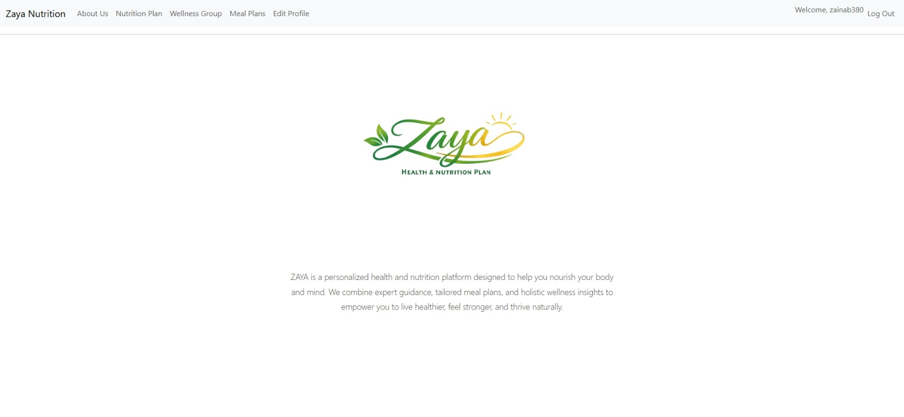
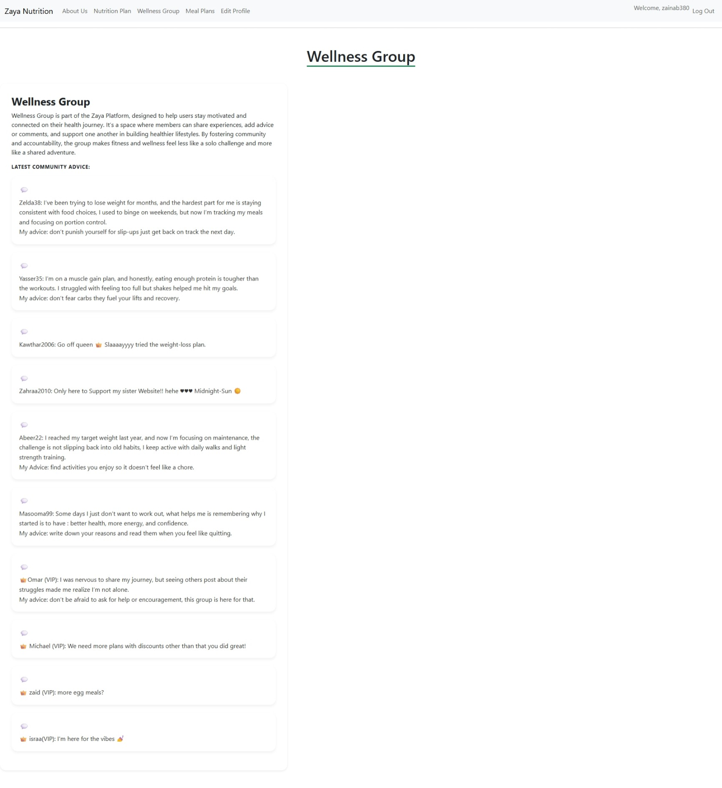
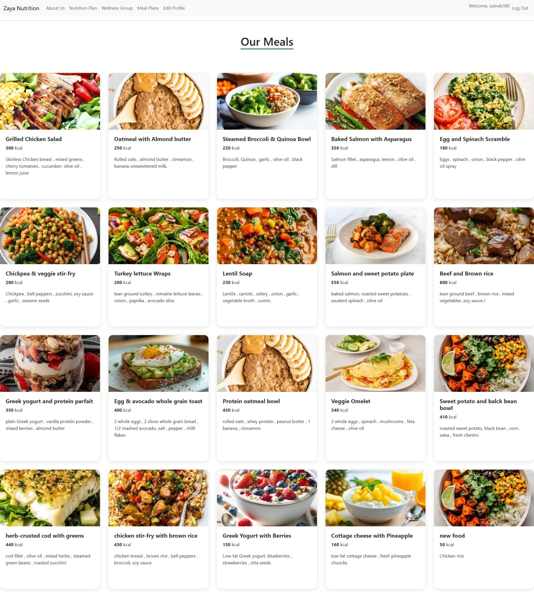
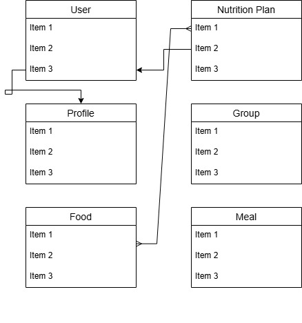

# Zaya-Health-Nutrition-Platform
 ZAYA is a personalized health and nutrition platform designed to help you nourish your body and mind.

# Project 4 : ZAYA

## Date: 6/5/2026

### By: Zainab Salman

***
[Github](https://github.com/ZELDA3)
[Linkedin](https://www.linkedin.com/in/zainab-salman-832213179?utm_source=share&utm_campaign=share_via&utm_content=profile&utm_medium=android_app)
[instagram](https://www.instagram.com/zainab.salman.380_?igsh=MWtqdTF0aXh2ZjJ5Ng==)

### ***Description***
####
Zaya is my final project at GA, the name itself is a blend of the first two letters of my name and two letters from a very dear friend of mine "Yasser", In Arabic “Zaya” carries a beautiful meaning: Fate or Destiny.
The platform aims to bring together people who are ready to change by sharing nutritional meals.

As I was going through many changes while shifting my career, I wanted to create something that could inspire change in others too, nothing is impossible everyone is capable!
I’m deeply grateful to all the people who supported me throughout this journey: "Michael Lackey", "Omar Kamal", "Zaid Sarhan", "Israa Ashoor", "Abeer Rozba","Yasser Hamed".

### ***Technologies Used***
*Django
*Pyhton
***

### ***Getting Started***
When visiting the website, users first need to sign up, after signing up and logging in, they create a profile that collects important information such as illnesses, medications, allergies, and dietary restrictions, based on these details, their nutrition plan is customized, but still if users are not satisfied with the given plan they can add, delete, or update meals within their plan.

There are three main plans to choose from: Muscle Gain, Weight Loss, or Maintenance, and if someone feels unsure about continuing because this is a long journey we all been there, so we created a community that is ready to share experiences and offer advice.

So what are you waiting for? Join ZAYA today and start your journey!

#####

##### A Trello board was used to keep track of development progress and can be viewed [here][[(https://trello.com/invite/b/69a006ae8a3cc03b2d643fa0/ATTI9da3a134643a9f8a88ee1663a02d9af3AD4FB79E/project-2).](https://trello.com/b/FoHPmX3Q/last-seb-project)](https://trello.com/invite/b/69f9ddce9586e0e2e16a10ff/ATTI7e49388cdbc44ec605fd5ac45cb2dc2d972764C4/last-seb-project)
##### The project Wireframe [here][(https://www.figma.com/design/g8SFkUtXf5uk8j2oG0rDnV/EstateHub?node-id=0-1&t=JF4WQQyDL2GDva10-1).
](https://www.figma.com/design/u50vlXhhd6rD53zob2RJR2/Untitled?node-id=0-1&p=f&t=TZ0m2LcoaJLR4Kd5-0)
***

### How does the website look like?

**About-Us Page:**

**Wellness-Group Page:**

**Meal-Items Page:**

##### ERD

### ***Future Updates***

- [ ] Adding trained coaches and their expertise so users can sign up with them and receive advice directly from professionals who truly know their field.
- [ ] Introducing AI‑powered journey tracking to provide personalized feedback, including insights such as identifying the month where users struggled the most.
- [ ] Making the app available on both iOS and Android devices, ensuring accessibility for all users.
***

### ***Credits***

##### Markdown Guide: [ia.net](https://ia.net/writer/support/general/markdown-guide)

##### Markdown Cheatsheet: [GitHub](https://guides.github.com/pdfs/markdown-cheatsheet-online.pdf)
***
